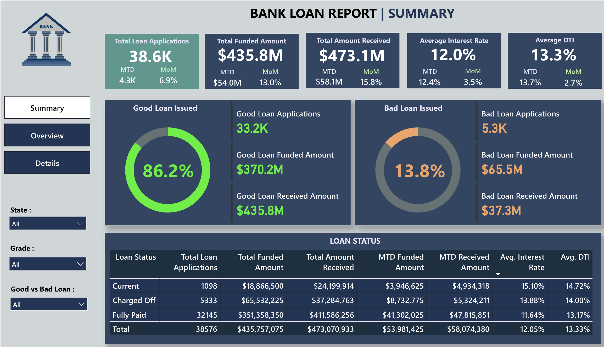
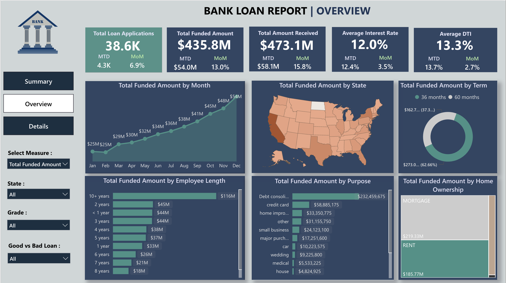
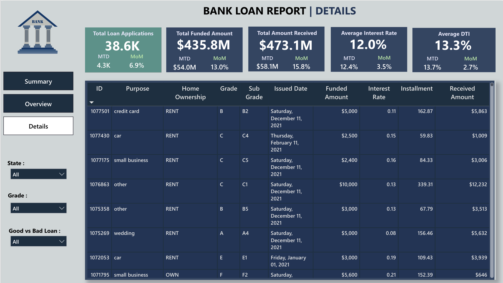

# Bank Loan Dashboard

This project contains a Power BI report that shows insights from a bank loan dataset.

## What's Inside
- `BANK_LOAN.pbix`: The Power BI report file.
- Three images showing different pages of the dashboard.

## Key Insights
- Loan approval and rejection trends
- Applicant information and risk categories

## How to View
Open the `.pbix` file using Power BI Desktop.

## Screenshots
  
  

